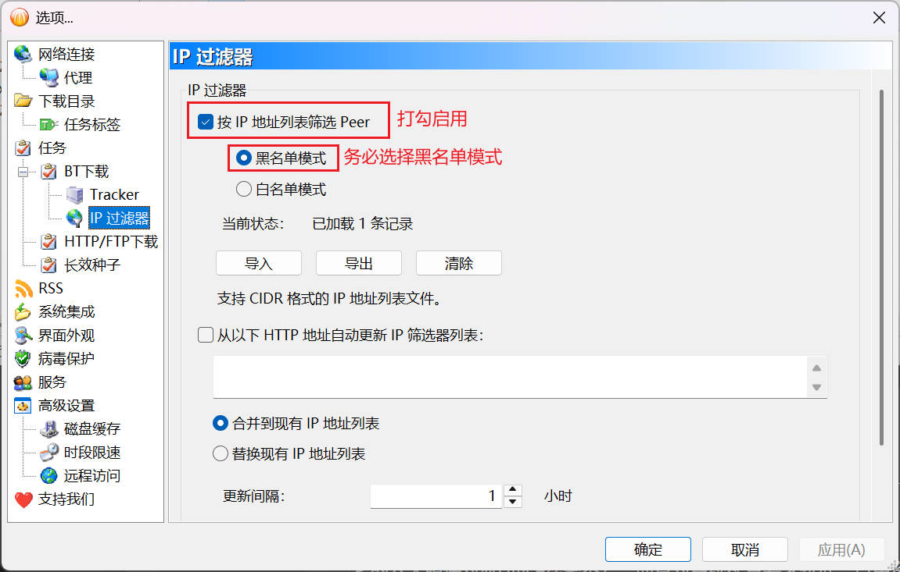

# BitComet

PeerBanHelper 使用 BitComet WebAPI 与 BitComet 交互。本章将介绍如何为 BitComet 启用 WebAPI 并将 PeerBanHelper 与 BitComet 连接。  

## 提示

:::danger

特别提示：BitComet 的支持目前处于高度实验性的状态，对封禁效果和运行稳定性不做任何保证。
:::

BitComet 用户可能频繁遇到 “正在封禁的 Peer 已处于封禁列表中”，此问题是由于 BitComet 的封禁操作是异步处理的，您可以安全的忽略这个警告（除非它连续不停地一直在提示）。  
如果您遇到封禁线程未响应或 "Unable to retrieve peers" 的错误提示，这通常是由于 BitComet 的 WebAPI 超时未响应的问题。该问题已被汇报给 BitComet，但目前尚未得到修复。请您无需担心，PBH 会在下一次封禁流程中，重新获取。

## 确认版本

PeerBanHelper 使用的 WebAPI 仅在 `v2.10 Beta6 [20240928]` 或者更高版本中可用。截至本文撰写时，v2.10 正式版还未发布。如果已发布正式版，请直接使用 v2.10 或者更高版本的正式版。  
任何更低版本的 BitComet 均无法使用且不受支持。

## 开启 IP 过滤器

“工具->选项” 打开 BitComet 设置界面，在打开的设置窗口的左侧树形菜单中依次展开 “任务-> BT 下载 -> IP 过滤器”，在过滤器配置页面勾选 “按 IP 列表筛选 Peer”，并选择 “黑名单模式”。

## 配置禁止多重连接

允许多重连接会扰乱 PBH 的反作弊代码，因此必须将其禁用。

在打开的设置窗口的左侧树形菜单中选择 “高级设置”，找到 `bittorrent.multi_peers_same_ip`，将它的值设置为 “否”。

## 禁用 WebUI 限速

默认情况下，WebUI 会受到网络连接中的速度限制选项的限制，这会影响 PBH 访问 BitComet WebAPI 的性能，并导致封禁失败和延迟，因此需要将其禁用。

在打开的设置窗口的左侧树形菜单中选择 “高级设置”，找到 `network.ignore_remote_access_in_speed_limit`，将它的值设置为 “是”。

## 启用远程访问

PeerBanHelper 需要使用远程访问功能连接 BitComet，这个功能默认关闭，需要您手动将其开启。

在打开的设置窗口的左侧树形菜单中选择 “高级设置->远程访问”，勾选 “启用网页版远程访问”，并设置一个用户名和密码。  
向下滚动，你还会看到端口号的设置，请记下上面显示的端口号设置。

全部填写完毕后，请记得保存。

## 在 PeerBanHelper 中添加 BitComet

在 PeerBanHelper 中打开添加下载器窗口，选择 BitComet 类型。

地址分为两种情况：

* 如果 BitComet 和 PeerBanHelper 在同一台设备上，请使用 `http://127.0.0.1:端口号`，其中 `端口号` 替换为你在上面步骤中记下的端口
* 如果 BitComet 和 PeerBanHelper 不在同一台设备上，请使用 BitComet 软件的 “高级设置->远程访问” 界面中，显示在用户名和密码框下面的地址

最后确定保存，测试通过即可使用。
