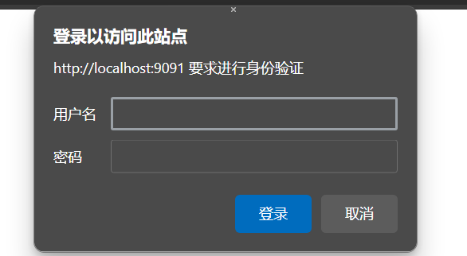

# 常见问题

## 无法通过 127.0.0.1 或 localhost 连接到下载器（ConnectException: null）

此问题通常在使用 Docker 容器部署时出现。在容器内部，`127.0.0.1` 或 `localhost` 指向容器自身，而非宿主机。

**群晖用户**：请在 Container Manager 中找到 PBH 容器，使用显示的网关地址进行连接。


**其他 Docker 用户**：执行 `sudo docker network inspect bridge` 命令，找到 Gateway 地址并进行连接。

## PeerBanHelper 能检测到需要封禁的 Peer 但是不封禁 (严重错误：下载器处于不正确的网络模式下，PeerBanHelper 可能不会工作)

通常是因为 IP 地址不正确，检查没有封禁的 Peer 的 IP 地址是否是 172.x.x.x, 10.x.x.x, 192.x.x.x 等内网 IP 地址。  
如果是，且下载器部署在 Docker 中，则必须将下载器的容器网络模式切换为 host 模式，而不能使用 bridge 模式。经过 Docker 转发的入站连接会因为丢失真实 IP 地址导致 PBH 不会工作。  

尽管你可以修改配置取消这个检查，但这并不推荐。一旦你这样做，PBH 将会 **错误地封禁所有的入站连接**，因此正确的设置网络模式是非常必要的。  

某些 IP 转发工具，如 Lucky, FRP 等可能会在用户空间转发数据表，这也会修改包的 IP 地址，并导致下载器中 Peer IP 显示不正确。如果您正在使用这些工具，请查看对应工具的帮助文档以寻求解决方案。  
OpenWRT/RouterOS 等高自由度路由固件可能需要检查 NAT 设定。

## 启动时报错：“Failed to bind to port / Port already in use. Make sure no other process is using port XXXX and try again.”

此错误通常意味着有两个 PeerBanHelper 实例同时尝试启动（特别是在安装时错误地勾选了“安装为系统服务”选项），或者该端口已被其他程序（如 Uplay/Ubisoft Connect 等）占用。

### 若已安装为系统服务

如果不确定如何操作，请运行卸载程序从系统中删除系统服务，重启计算机后重新安装。

### 若 Uplay/Ubisoft Connect 正在运行或其他程序占用 WebUI 端口

请关闭这些程序，或者[更改 WebUI 端口配置](./network/http-server.md#更改-webui-端口)。

## 无法下载 IPDB/GeoIP 库或代理无效

请参见：[配置代理服务器](./network/proxy-server.md)。

## WebUI 管理 Token 在哪里？

请参见：[更改 WebUI Token](./network/http-server.md#更改-webui-token)。

## 为什么弃用了 Transmission 下载器？

请参见：[废弃对 Transmission 下载器的支持 #382](https://github.com/PBH-BTN/PeerBanHelper/issues/382)。

## 反吸血进度检查器为何显示进度超过 100%？

进度检查器会累加特定种子上的下载进度。若对方出现进度回退、断开重连、更换 PeerID 或 Client name，下载器会视为新客户端并重新计算数据。但 PBH 会持续累积进度，避免对方欺骗反吸血检查。例如，文件大小为 1000MB，对方下载 102% 即表示实际下载了 1020MB 数据。

## PBH 提示下载器“连续多次登录失败”并暂停怎么办？

请点击下载器的编辑按钮，然后直接点击确定保存。PBH 将解除暂停并重新尝试登录，显示登录失败原因。请根据原因进行排查（如网络连接、WebUI 是否启用、用户名密码等），排查后保存即可解除暂停。

## 什么是增量封禁？

- **非增量封禁**：每次封禁新 IP 时，替换整个 IP 黑名单列表。在 qBittorrent 上可能导致下载器卡死。
- **增量封禁**：每次封禁新 IP 时，使用 banPeer API 增量添加；解除封禁时仍替换整个列表。

## 什么是验证 SSL 证书？

若填写的地址是 HTTPS 地址，且启用此开关，则会验证 SSL 证书的有效性。无效则报错以保证安全。若关闭，则信任所有 SSL 证书。

## 什么是 Basic Auth？

Basic Auth 是在浏览器访问时弹出用户名密码验证框的安全机制。



## 统计数据中封禁计数为何比访问计数多？

当 Peer 连接并产生流量时计为一次访问。若 Peer 在产生流量前被封禁（如握手阶段），则只记为一次封禁。

## 如何永久封禁 IP？

请使用 [IP 黑名单功能](./module/ip-address-blocker.md)。

## 为何无法编辑自定义脚本？什么是“只读模式”？

出于安全考虑，脚本编辑功能拒绝来自互联网的请求，以防 Token 泄漏导致设备受损。若确需在互联网上编辑脚本，并理解相关风险（Token 泄漏后黑客可执行任意代码），可在启动时添加以下标志：
```
java -Dpbh.please-disable-safe-network-environment-check-i-know-this-is-very-dangerous-and-i-may-lose-my-data-and-hacker-may-attack-me-via-this-endpoint-and-steal-my-data-or-destroy-my-computer-i-am-fully-responsible-for-this-action-and-i-will-not-blame-the-developer-for-any-loss ...
```
**注意**：此操作极具风险，请务必谨慎使用。