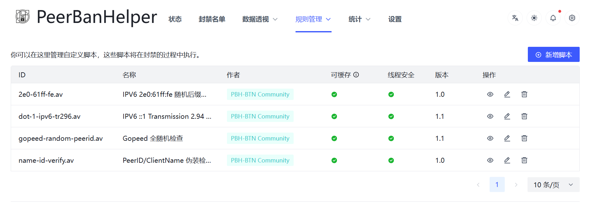

# AviatorScript 引擎

PeerBanHelper 允许用户加载 [AviatorScript 用户脚本](https://www.yuque.com/boyan-avfmj/aviatorscript/cpow90)。  

## 简述

AviatorScript 允许用户加载一个用户脚本，以便在 PBH 检测 Peer 时执行自定义的代码。支持反射、实例创建等高级操作，拥有完整编程能力。  
有时 PBH 遇到新变种时，在无法发布新版本 PBH 的情况下，会向社区公开 AviatorScript 脚本，以便在不更新 PBH 的情况下进行检查和封禁。

## 安装 AviatorScript 脚本

AviatorScript 脚本以 `.av` 结尾。将其放入 `data/scripts/` 目录即可加载。  
如果你是本地安装，则可以直接通过 WebUI 管理脚本。



特别的，如果你是在内网环境下，则还可以直接上传和编辑脚本文件。


## 制作 AviatorScript 脚本

要使 AviatorScript 脚本可被 PBH 加载，则需要在文件开头加入元数据头：

```av
## @NAME PeerID/ClientName 伪装检查
## @AUTHOR PBH-BTN Community
## @CACHEABLE true
## @VERSION 1.0
## @THREADSAFE true
```

**字段示意：**

* `@NAME` 脚本名称
* `@AUTHOR` 脚本作者
* `@CACHEABLE` 结果是否对相同 Peer 可缓存，如果你的脚本需要对一个 Peer 持续进行检查（而非只检查一次），则需要将其设置为 false。
* `@VERSION` 版本号
* `@THREADSAFE` 是否是线程安全的脚本

### 预设变量

一些变量在执行前就已提前注入到 AviatorScript 运行时，您可以直接使用它们，参见配置文件。  

### 返回值

AviatorScript 支持如下返回值。不同的类型和值对应不同的行为：

* String: 以`@`开头：以指定理由跳过其它用户规则 不以`@`开头：以指定理由封禁Peer
* Boolean：`false`=不采取任何操作 `true`=封禁Peer
* Integer: `0`=不采取任何操作 `1`=封禁Peer `2`=跳过其它用户规则
* com.ghostchu.peerbanhelper.module.PeerAction: `NO_ACTION`=不采取任何操作 `BAN`=封禁 `SKIP`=跳过其它用户规则
* com.ghostchu.peerbanhelper.module.BanResult: 按照对象内的描述进行操作

可以查看 `src/resources/scripts` 中的脚本文件查看真实世界的示例。

## 配置文件

```yaml
  # 规则引擎，支持 AviatorScript 语言 - User script, support AviatorScript
  # 提供在 PBH 上自行编程编写规则的能力 - Provide programming ability on PBH
  expression-engine:
    # 规则列表 - Rule lists
    # 在 AviatorScript 执行时，PBH 会注入以下环境变量，您可以自由使用它们：
    # You can feel free use them in AviatorScript files
    # peer - 一个 com.ghostchu.peerbanhelper.peer.Peer 对象，您可以使用这个对象下面的任何属性，这些是您可能用到的：
    # peer - an com.ghotchu.peerbanhelper.peer.Peer instance, you can access any property under this object, these is you might will used
    # peer.peerAddress.ip - 字符串型 IP 地址 - IP address in String
    # peer.peerAddress.port - 整型端口号 - Port in int
    # peer.peerAddress.address - IPAddress 对象，可提供高级功能 -  IPAddress object
    # peer.peerId - 字符串型 PeerID，在不支持的下载器上可能为空字符串，使用 isEmpty 判断 - PeerID in String, may be empty string on not supported downloader, check them with isEmpty
    # peer.clientName - 客户端名称，在不支持的下载器上可能为空字符串，使用 isEmpty 判断 - PeerID in String, may be empty string on not supported downloader, check them with isEmpty
    # peer.downloadSpeed - 您的下载器从该 Peer 下载数据的速率（bytes） - Download rate from Peer
    # peer.uploadSpeed - 您的下载器向该 Peer 上传数据的速率（bytes） - Upload rate to Peer
    # peer.downloaded - 您的下载器从该 Peer 下载的数据的累计数据量（bytes），在不支持的下载器上为 -1 - Downloaded bytes from Peer, -1 on not supported downloader
    # peer.uploaded - 您的下载器从该 Peer 上传的数据的累计数据量（bytes），在不支持的下载器上为 -1 - Uploaded bytes to Peer, -1 on not supported downloader
    # peer.progress - 此 Peer 汇报的自己的下载进度，浮点型数据，0.00=0%，1.00=100% - The percentage that Peer reporting, percent in float
    # peer.flags - 由您的下载器汇报的此 Peer 的 Flags 状态，各下载器对其定义可能有所不同, Peer flags
    # torrent - 一个 com.ghostchu.peerbanhelper.torrent.Torrent 对象，您可以使用这个对象下面的任何属性 - an com.ghotchu.peerbanhelper.torrent.Torrent instance, you can access any property under this object, these is you might will used
    # torrent.id - 在您的下载器内，此 Torrent 的对应内部 ID 标识符 - Torrent Identifier in Downloader internal
    # torrent.name - 此 Torrent 的名称 - Torrent name
    # torrent.hash - 此 Torrent 的 InfoHash，具体是 v1 还是 v2，由您使用的下载器的偏好而定 - Torrent info hash
    # torrent.progress - 您的下载器上，此 Torrent 的任务进度 - Torrent progress on your downloader
    # torrent.size - 此 Torrent 的任务大小 - Torrent size
    # torrent.rtUploadSpeed - 您的下载器上的此任务的当前上传速率（bytes） - Torrent task upload rate
    # torrent.rtDownloadSpeed - 您的下载器上的此任务的当前下载速率（bytes） - Torrent task download rate
    # torrent.hashedIdentifier - 此 Torrent 的匿名哈希标识符 - Torrent identifier (generated by PBH for privacy and BTN usage)
    # peerbanhelper - PBH 主实例 (Main instance)
    # HTTPUtil - 提供脚本对网络的访问能力，但请注意，脚本通常只有 1500ms 的执行时间，网络请求也包含在内 - Util for request network
    # JsonUtil - 提供脚本对 JSON 内容的解析能力 - Util for parse Json
    # IPAddressUtil - 提供将字符串的 IP/CIDR 转换为 IPAddress 对象的工具 - Util for processing IPAddress
    # Main - 启动主类，可用于访问配置文件 - Main instance
    # 对于其它的常用函数，语法等，参见 AviatorScript 文档：https://www.yuque.com/boyan-avfmj/aviatorscript/cpow90
    # For more details, check AviatorScript documentation: https://www.yuque.com/boyan-avfmj/aviatorscript/cpow90
    # 规则引擎支持 AviatorScript 的全部能力，您可以自由使用反射或者动态创建特性
    # PBH support full ability, feel free to use reflect or dynamic creating.
    #
    # 每个规则必须提供一个返回值，PBH 会根据您提供的返回值，决定此 Peer 是否封禁。支持的返回值如下：
    # Every single rule must provide a return code, PBH will determine if we need ban this peer, supported return code listed below:
    #   Boolean: [false=不采取任何操作, true=封禁Peer] - Boolean [false = No action will be taken, true = Peer will be banned]
    #   Integer: [0=不采取任何操作,1=封禁Peer,2=跳过其它用户规则] - Integer [0 = No action will be taken, 1 = Peer will be banned, 2 = Skip other rules]
    #   com.ghostchu.peerbanhelper.module.PeerAction: [NO_ACTION, BAN, SKIP]
    #   com.ghostchu.peerbanhelper.module.BanResult
    #
    # 所有的脚本文件默认放置在 data/scripts 目录内，您也可以修改已有的、或者新建新的脚本文件
    # All script files will put in data/scripts, you can modify exists scripts or create your own scripts/
    # 是否启用
    enabled: true
    # 封禁时间，单位：毫秒，使用 default 则跟随全局设置
    ban-duration: default
```
