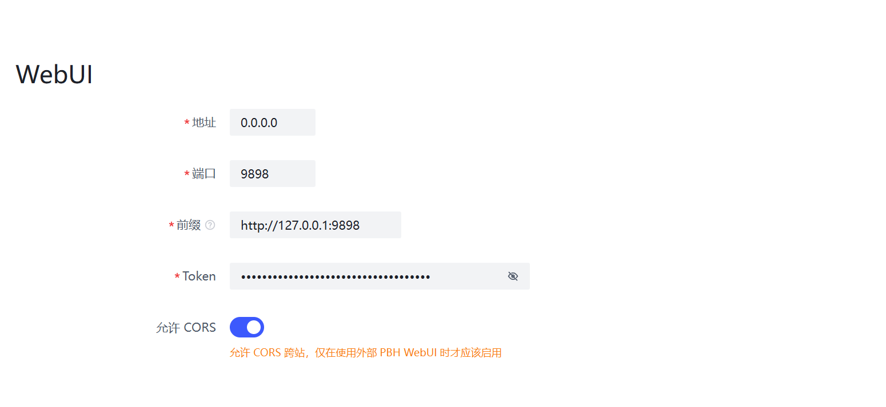

# HTTP 服务器

PeerBanHelper 内置了 Javalin 作为内置 HTTP 服务器，以提供 WebUI 管理界面，并和部分下载器进行交互。

## 更改 WebUI 端口

```yaml
# Http 服务器设置
# Http Server Settings
server:
  # WebUI 监听端口
  # WebUI listen port
  http: 9898
```

或者通过 WebUI 直接修改：



## 关闭公网监听，仅开放本地的 WebUI 和下载器封禁列表提供端点访问

```yaml
# Http 服务器设置
# Http Server Settings
server:
  ...
  # WebUI 监听地址，如果需要从非本机访问，请修改为 0.0.0.0，本机部署建议使用 127.0.0.1 提高安全性
  # WebUI listen address, if you need access from non-localhost location, change it to 0.0.0.0. Locally deploy use 127.0.0.1 is recommended.
  address: "0.0.0.0"
```

或者通过 WebUI 直接修改 “地址” 配置项。

`0.0.0.0`：监听所有网卡的端口  
`127.0.0.1`：监听本地回环端口（仅本机可以访问）  
`网卡 IP 地址`：只有对应网卡的流量可以访问

## 使用外部 WebUI

PeerBanHelper 可以从文件系统加载外部 WebUI 文件。

首先需要在 `data/` 文件夹手动创建一个 `static` 目录，里面放置 WebUI 文件。  
然后在配置文件中手动添加一行隐藏配置，让 PBH 使用外部 WebUI 文件：

```yaml
# Http 服务器设置
# Http Server Settings
server:
  ...
  # 使用外部 WebUI
  external-webui: true
```

## 使用不同域的 WebUI

PeerBanHelper 开启了 CORS 保护，如果使用来自其它位置（非内置 HTTP 服务器提供）的 WebUI，则会被 CORS 拒绝。因此您需要禁用 CORS 保护：

```yaml
# Http 服务器设置
# Http Server Settings
server:
  ...
  # 允许 CORS 跨站，仅在使用外部 PBH WebUI 时才应该启用
  # Allow CORS, should be enabled when you use external WebUI only.
  allow-cors: false
```

或者在 WebUI 中直接切换 “允许 CORS” 开关。

## 更改 WebUI Token

如果不幸忘记了 WebUI 的 Token 是什么，又或者您想修改下 Token，则可以在配置文件中修改：

```yaml

# Http 服务器设置
# Http Server Settings
server:
  ...
  # 要访问 WebUI 端点，则需要 Token。如果这里为空，PBH 在启用时将进入 OOBE 向导，指导您进行基本配置
  # To access the WebUI endpoint, token is required. If there is empty string, OOBE will start to guide you set it.
  token: ""
```

或者在 WebUI 中直接修改，修改后需要重新登录。

## 开发自己的 WebUI / WebAPI

我们鼓励开发者为 PeerBanHelper 编写或改进 WebUI。

自 v6.0.1 开始，您可以在这里查看完整的 API 文档：

[https://peerbanhelper.apifox.cn](https://peerbanhelper.apifox.cn)

请注意：如果 WebAPI 连续鉴权失败 10 次，您的 IP 地址会被防暴力破解系统屏蔽 15 分钟。

## 配置文件

```yaml
# Http 服务器设置
# Http Server Settings
server:
  # WebUI 监听端口
  # WebUI listen port
  http: 9898
  # WebUI 监听地址，如果需要从非本机访问，请修改为 0.0.0.0，本机部署建议使用 127.0.0.1 提高安全性
  # WebUI listen address, if you need access from non-localhost location, change it to 0.0.0.0. Locally deploy use 127.0.0.1 is recommended.
  address: "0.0.0.0"
  # 在 PBH 需要给下载器传递地址时，将使用此地址传递，请确保此地址最终可被下载器访问，请【不要】以 / 结尾
  # When PBH need pass the URL of blocklist to downloader, it will use this address as prefix, make sure this URL can be access from your downloader. DO NOT end with slash (/)
  prefix: "http://127.0.0.1:9898"
  # 要访问 WebUI 端点，则需要 Token。如果这里为空，PBH 在启用时将进入 OOBE 向导，指导您进行基本配置
  # To access the WebUI endpoint, token is required. If there is empty string, OOBE will start to guide you set it.
  token: ""
  # 允许 CORS 跨站，仅在使用外部 PBH WebUI 时才应该启用
  # Allow CORS, should be enabled when you use external WebUI only.
  allow-cors: false
```