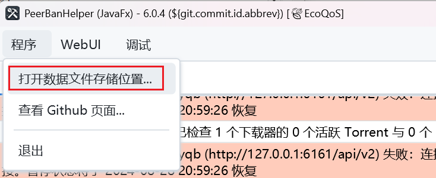
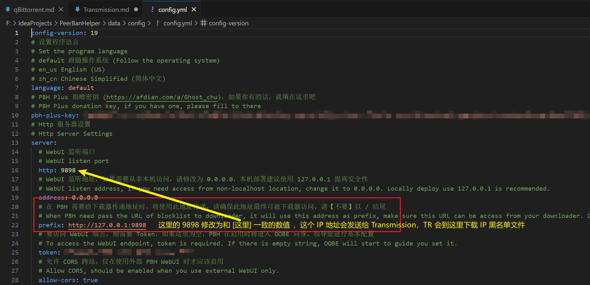
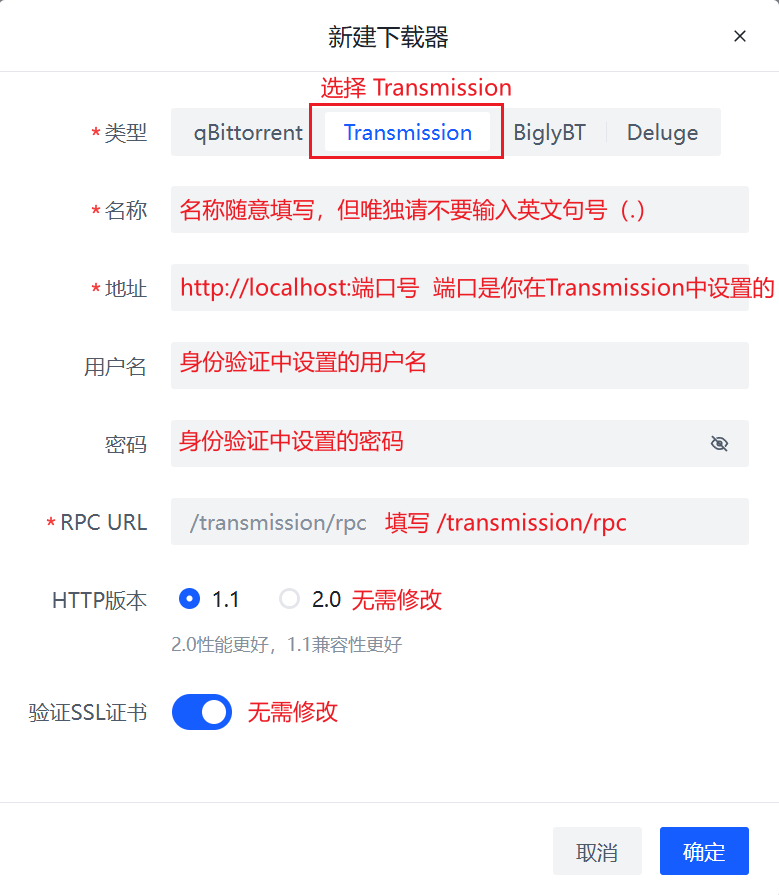

# Transmission

:::warning

All downloaders that deploy in Docker MUST use host network mode to make sure downloader can get correct incoming connection IP address, bridge will break it and not supported. PeerBanHelper may not working if you downloader not in correct network mode.

:::

:::danger

Transmission has been marked as **deprecated** by PeerBanHelper. You should stop using it. Using Transmission **will not receive any support**. If you open an Issue or ask questions in the QQ group due to Transmission-related problems, your messages will be deleted, or you will be muted.  
The Transmission adapter will no longer receive any feature enhancements or bug fixes and may be removed in the future.

:::

For users using Transmission on Linux or Docker, you have probably already configured the WebUI and can skip the following steps.

## Enable WebUI

1. Click the "Edit" menu, go to "Preferences," and switch to the "Remote" tab.
2. Check "Allow remote access."
3. Check "Use authentication" and set a username and password.
4. Click "Close."

  


## Configure PeerBanHelper Blocklist Endpoint

1. In PeerBanHelper, open the "Program" menu and select "Open Data File Location...".
2. Navigate to the `config` directory.
3. Open and edit the `config.yml` file. It is recommended to use [VSCode](https://code.visualstudio.com/) to avoid syntax errors or encoding issues.
4. Locate the `server.prefix` field and update its IP address and port. **Note**: This address must be accessible **from** Transmission.
5. Save the file and restart PeerBanHelper.

  


## Add Transmission to PeerBanHelper

1. Open the Add Downloader window.
2. Select "Transmission" as the downloader type at the top.
3. The name can be arbitrary but must not include a period (`.`).
4. For the address, fill in `http://localhost:port`, where the port matches the one configured in the WebUI. Ensure the address does **not** end with `/`.
5. The username is the one set during "authentication" setup.
6. The password is the one set during "authentication" setup.
7. Click "OK." If you receive a success prompt, the addition is complete.

## Verify Functionality

The IP blacklist for Transmission is external, but PBH dynamically generates the blacklist for Transmission. Therefore, you must ensure that Transmission can access PBH's endpoint.  
After adding the downloader, monitor PBH's log for a while. If no errors regarding Transmission blacklist settings appear, the configuration is successful.



## Re-enable Deprecated Transmission

Since version 6, PBH has prohibited users from creating new Transmission downloaders, but you can lift this restriction.

:::danger

Transmission has been marked as **deprecated** by PeerBanHelper. You should stop using it. Using Transmission **will not receive any support**. If you open an Issue or ask questions in the QQ group due to Transmission-related problems, your messages will be deleted, or you will be muted.  
The Transmission adapter will no longer receive any feature enhancements or bug fixes and may be removed in the future. This option is only provided for transition purposes.

:::

If you do not understand the following instructions, do not ask for help or request support. Consider switching to another supported downloader.

For the PBH installation version, add the following parameter to the `vmoptions` file (for the Portable version, modify the `.bat` file):

```
-Dpbh.downloader.transmission.i-know-transmission-is-discourage-and-could-be-removed-in-future-please-dont-show-require-take-actions-status-text-and-i-know-what-i-am-doing=true
```


For the Docker version, modify the startup command accordingly.

Then, add the following configuration to the `client` section in `config.yml`:

```yaml
your_transmission_name:
  type: transmission
  endpoint: http://your-transmission-webui:your-port
  username: your-username
  password: your-password
  rpc-url: /transmission/rpc
  http-version: HTTP_1_1
  verify-ssl: false
  ignore-private: true
```