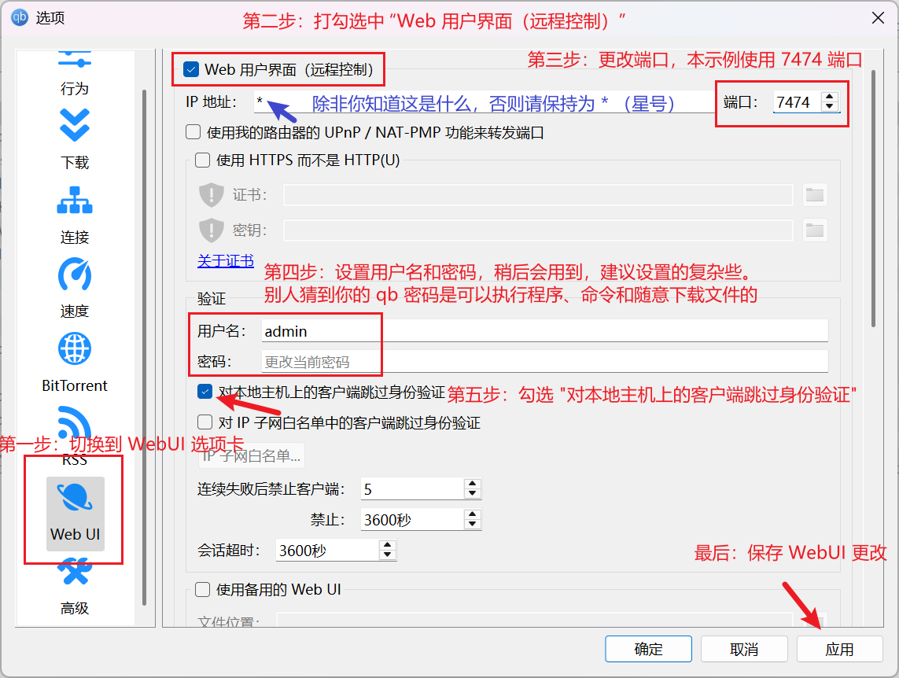

# qBittorrent

PeerBanHelper interacts with qBittorrent using the qBittorrent WebAPI. This chapter will guide you on enabling the WebUI for qBittorrent and connecting PeerBanHelper to qBittorrent.  
For Linux and Docker users running qBittorrent, you may have already configured the WebUI and can skip the initial steps.

## Enable WebUI

Click the gear icon on the main page to open the settings menu.

Then, follow these steps:

1. In the left menu, switch to the "WebUI" tab.
2. Check "Web User Interface (Remote control)."
3. Configure a port number. In this example, we use `7474`. Note: The IP address refers to the "Listening interface address." If you're unsure what this means, leave it as the default (`*`).
4. Under "Authentication," set a username and a strong password. A strong password is crucial to prevent unauthorized access, as anyone with your credentials can manipulate downloads or execute commands/programs via qBittorrent.
5. Finally, click the "Apply" button at the bottom-right to save your settings.

## Configure Advanced Settings

In addition to enabling the WebUI, there are additional settings to ensure PeerBanHelper works correctly:

1. In the left menu, switch to the "Advanced" tab.
2. Locate "Resolve peer hostnames" and **uncheck** it if it is enabled.
3. Scroll further down to the "libtorrent" section and find "Allow multiple connections from the same IP address." **Uncheck** it if it is enabled.

## Add qBittorrent Downloader in PeerBanHelper

Follow these steps to add a qBittorrent downloader in PeerBanHelper:

1. Open the Add Downloader window.
2. Select "qBittorrent" as the downloader type.
3. Choose a name for the downloader. The name can be arbitrary but must not contain periods (`.`).
4. In the address field, enter `http://localhost:7474`, where `7474` is the port number you set earlier. Be careful not to end the address with a `/`.
5. Enter the username set in the "Authentication" section above.
6. Enter the password set in the "Authentication" section above.
7. Click "OK." If the connection test is successful, the downloader is successfully added.

