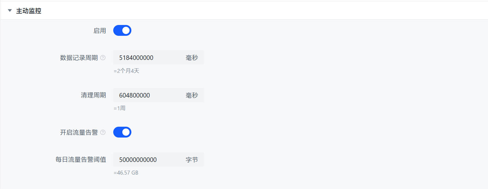

# Active Monitoring

Some of the statistical features provided by PBH require this module to be enabled.  
When active monitoring is enabled, PBH will store and update all Peers data obtained during each scan of the downloader into the database to provide visual statistics and traffic alert services.  

It is not recommended to enable this feature for users with EMMC chips or SD cards. Besides affecting performance, it may also accelerate flash memory wear.  

Transmission and BitComet users may have missing data due to API limitations.

## Features Supported by This Function

* Traffic statistics charts
* Trend charts
* Non-blocked part of the GeoIP charts

## Configure Traffic Alerts

Go to Settings -> Preferences, scroll down to find "Active Monitoring," enable traffic alerts, and configure the daily traffic alert threshold.



After configuring, click the "Save" button at the bottom of the page to apply the changes.

## Peer Data Recorded

For IP-torrent records, each IP connected to a different torrent is considered a separate session.

* Session IP address
* Session Torrent metadata
* Session downloader name
* Last used Peer ID in the session
* Last used Peer ClientName in the session
* Total data uploaded to Peer during the session
* Last recorded downloader statistics for uploaded data in the session
* Total data downloaded from Peer during the session
* Last recorded downloader statistics for downloaded data in the session
* Peer flags when the session was last seen
* Session start time
* Session last update time

## Configuration File

```yaml
  # Active Monitoring
  # This feature allows PeerBanHelper to actively record data fetched from the downloader into a local SQLite database
  # The data generated can be used by other modules (e.g., generating charts and reports)
  # NOTE: It is not recommended to enable this feature if PBH is running on SDCard or EMMC Flash chip.
  # This feature puts a high read/write pressure on the storage device, possibly accelerating flash memory wear or causing the storage device to overheat.
  # NOTE: This may lead the database size to increase rapidly, and it is not recommended to use this feature on storage devices with limited space.
  active-monitoring:
    # Enable this feature
    enabled: true
    # Retention period
    # Please note: Due to SQLite's characteristics, when records are deleted, the disk space is not released, but new data will reuse the freed space.
    # Therefore, choose a reasonable retention period.
    # Time unit: ms; Default: 5184000000 (60 days)
    data-retention-time: 5184000000
    # Cleanup check interval
    # Data cleanup task will be performed every interval milliseconds.
    # Do not set this to be too frequent, as SQLite is a single-threaded database and cannot execute multiple SQL queries simultaneously. Slow queries may cause PBH data write delays or deplete RAM.
    # Time unit: ms; Default: 604800000 (7 days)
    data-cleanup-interval: 604800000
