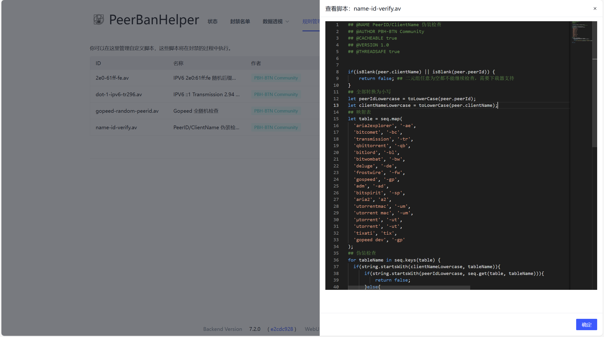

# AviatorScript Engine

PeerBanHelper allows users to load [AviatorScript user scripts](https://www.yuque.com/boyan-avfmj/aviatorscript/cpow90).

## Overview

AviatorScript allows users to load a user script to execute custom code when PBH detects a Peer. It supports advanced operations like reflection and instance creation, offering full programming capabilities.  
Sometimes, when PBH encounters a new variant and cannot release a new PBH version, AviatorScript scripts are made available to the community so that checks and bans can be performed without updating PBH.

## Installing AviatorScript Scripts

AviatorScript scripts end with `.av`. Simply place them in the `data/scripts/` directory to load them.  
If you have a local installation, you can manage the scripts directly through the WebUI.


Additionally, if you are in an intranet environment, you can directly upload and edit script files.



## Creating AviatorScript Scripts

To make an AviatorScript script loadable by PBH, you need to add metadata at the beginning of the file:

```av
## @NAME PeerID/ClientName Spoof Check
## @AUTHOR PBH-BTN Community
## @CACHEABLE true
## @VERSION 1.0
## @THREADSAFE true
```
### Field Description:

* `@NAME` Script name
* `@AUTHOR` Script author
* `@CACHEABLE` Whether the result can be cached for the same Peer. If your script needs to continually check a Peer (rather than checking it just once), set this to false.
* `@VERSION` Version number
* `@THREADSAFE` Whether the script is thread-safe

### Predefined Variables

Some variables are pre-injected into the AviatorScript runtime before execution, and you can use them directly. See the configuration file for more details.

### Return Values

AviatorScript supports the following return values. Different types and values correspond to different behaviors:

* String: Starts with `@`: skips other user rules with a specified reason. Does not start with @: bans Peer with a specified reason.
* Boolean: `false` = no action; `true` = ban Peer.
* Integer: `0` = no action; `1` = ban Peer; `2` = skip other user rules.
* com.ghostchu.peerbanhelper.module.PeerAction: `NO_ACTION` = no action; `BAN` = ban; `SKIP` = skip other user rules.
* com.ghostchu.peerbanhelper.module.BanResult: Operates based on the description inside the object.

You can check scripts in the `src/resources/scripts` directory for real-world examples.

## Configuration File

```yaml
  # Rule engine, supports AviatorScript language - User script, support AviatorScript
  # Provides the ability to program custom rules on PBH - Provide programming ability on PBH
  expression-engine:
    # Rule lists
    # During AviatorScript execution, PBH injects the following environment variables, feel free to use them:
    # You can feel free use them in AviatorScript files
    # peer - A com.ghostchu.peerbanhelper.peer.Peer object, you can use any property under this object, these are the properties you might use:
    # peer - an com.ghostchu.peerbanhelper.peer.Peer instance, you can access any property under this object, these are you might will used
    # peer.peerAddress.ip - IP address in String
    # peer.peerAddress.port - Port in int
    # peer.peerAddress.address - IPAddress object, providing advanced functionality
    # peer.peerId - PeerID in String, may be empty string on unsupported downloaders, check with isEmpty
    # peer.clientName - Client name, may be empty string on unsupported downloaders, check with isEmpty
    # peer.downloadSpeed - The download rate from the Peer in bytes
    # peer.uploadSpeed - The upload rate to the Peer in bytes
    # peer.downloaded - Total downloaded bytes from the Peer, -1 on unsupported downloaders
    # peer.uploaded - Total uploaded bytes to the Peer, -1 on unsupported downloaders
    # peer.progress - The download progress reported by this Peer, percentage in float
    # peer.flags - The flags state of the Peer reported by your downloader, definitions may vary between downloaders
    # torrent - A com.ghostchu.peerbanhelper.torrent.Torrent object, you can access any property under this object:
    # torrent.id - Torrent identifier in your downloader
    # torrent.name - Torrent name
    # torrent.hash - Torrent InfoHash, whether it's v1 or v2 depends on your downloader preferences
    # torrent.progress - Torrent progress on your downloader
    # torrent.size - Torrent size
    # torrent.rtUploadSpeed - Torrent task upload rate on your downloader
    # torrent.rtDownloadSpeed - Torrent task download rate on your downloader
    # torrent.hashedIdentifier - Torrent anonymous identifier (generated by PBH for privacy and BTN usage)
    # peerbanhelper - PBH main instance (Main instance)
    # HTTPUtil - Provides network access in scripts, but scripts usually have a 1500ms execution time, which includes network requests
    # JsonUtil - Provides JSON parsing ability in scripts
    # IPAddressUtil - Provides tools to convert string IP/CIDR to IPAddress objects
    # Main - Main instance, can access configuration files
    # For other common functions, syntax, etc., refer to the AviatorScript documentation: https://www.yuque.com/boyan-avfmj/aviatorscript/cpow90
    # PBH supports the full abilities of AviatorScript, feel free to use reflection or dynamic creation
    #
    # Each rule must provide a return value, PBH will determine whether to ban the Peer based on the return value. Supported return values are:
    # Every single rule must provide a return code, PBH will determine if we need ban this peer, supported return code listed below:
    #   Boolean: [false = No action will be taken, true = Peer will be banned]
    #   Integer: [0 = No action will be taken, 1 = Peer will be banned, 2 = Skip other rules]
    #   com.ghostchu.peerbanhelper.module.PeerAction: [NO_ACTION, BAN, SKIP]
    #   com.ghostchu.peerbanhelper.module.BanResult
    #
    # All script files are placed in the data/scripts directory by default, you can modify existing scripts or create your own.
    # All script files will put in data/scripts, you can modify exists scripts or create your own scripts/
    # Enabled: true
    # Ban duration in milliseconds, use default to follow global settings
    ban-duration: default
```